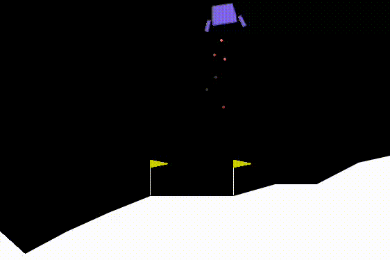

# 🚀 Multilevel Temporal-Task Reinforcement Learning

A research framework for training reinforcement-learning agents on temporally extended tasks in **Gymnasium's LunarLander-v3** environment. The framework combines finite-state task automata, configurable spatial abstractions, multilevel value functions, and potential-based reward shaping to guide a ground-level learner through complex waypoint missions.

The project accompanies the thesis documents available in [`documents/`](documents/).

<p align="center">
  
</p>

## ✨ Features

- **Temporal task specifications** — episodic LTLf formulas are converted to deterministic finite automata with `ltlf2dfa` and MONA.
- **Continuing tasks** — cyclic waypoint sequences support repeated completion rewards and configurable cycle limits.
- **Spatial semantics** — circular regions and axis-aligned half-plane predicates connect continuous observations to atomic propositions.
- **Multilevel abstraction** — arbitrary rectangular grids can be chained from fine to coarse resolutions.
- **Hybrid abstract solvers** — use tabular learning at intermediate levels and either value iteration or learning at the top level.
- **Potential-based reward shaping** — abstract value functions guide lower levels and the ground agent.
- **Ground learners** — standard DDQN, dueling DDQN, and sparse tabular Q-learning.
- **Target-network options** — Polyak averaging or periodic hard updates.
- **Unbiased control learner** — optionally train a second learner on the original task reward using batches collected by the shaped behavior policy.
- **Reproducible experiments** — consecutive seeded runs, fixed-seed greedy evaluations, archived configurations, logs, and checkpoints.
- **Diagnostics** — automaton diagrams, abstraction heatmaps, learning curves, reward breakdowns, replay-buffer composition, variance plots, and tabular coverage statistics.
- **Post-processing and evaluation** — regenerate plots from saved metrics and evaluate best or final policies independently.

## 🗂️ Repository layout

```text
.
├── README.md
├── assets/
│   └── framework-presentation.gif     # Animated framework overview used in this README
├── documents/                         # Thesis PDF files
├── templates/
│   ├── abstractions/                  # Ready-made grid hierarchies
│   ├── trajectories/                  # Episodic LTLf missions
│   └── cyclic/                        # Continuing waypoint missions
└── multilevel_framework/
    ├── config/                        # Active default task and abstraction configs
    ├── docker/
    │   ├── Dockerfile
    │   └── requirements-docker.txt
    ├── src/
    │   ├── trainer.py                 # Training CLI and experiment lifecycle
    │   ├── agent.py                   # DDQN, dueling DDQN, replay buffer, tabular Q-learning
    │   ├── abstract_mdps.py           # Automata and multilevel product MDPs
    │   ├── abstraction.py             # Hierarchy configuration and grid mappings
    │   ├── spatial_regions.py         # Regions, predicates, and rasterisation
    │   ├── automaton_validator.py     # Task/automaton consistency checks
    │   └── utils.py                   # Persistence and visualisation utilities
    ├── others/                        # Evaluation, comparison, and analysis tools
    ├── run_experiment.sh              # GPU-enabled training launcher
    ├── run_evaluation.sh              # Saved-policy evaluation launcher
    └── run_value_iteration_benchmark.sh
```

Experiment artifacts are created under `multilevel_framework/results/<experiment-name>/` and are ignored by Git.

## ⚙️ Requirements

The supported setup is Docker-based. You need:

- Docker;
- an NVIDIA GPU with a compatible driver;
- NVIDIA Container Toolkit, so Docker can expose the GPU to the container;
- Bash for the launcher scripts.

The image is based on Python 3.11 and installs CUDA-enabled PyTorch 2.7.1, Gymnasium with Box2D, NumPy, Matplotlib, pandas, Graphviz, `ltlf2dfa`, and MONA.

## ▶️ Quick start

From the repository root:

```bash
cd multilevel_framework
chmod +x run_experiment.sh run_evaluation.sh run_value_iteration_benchmark.sh

./run_experiment.sh \
  --experiment-name first-run \
  --episodes 10000 \
  --eval-interval 1000 \
  --eval-episodes 100
```

The launcher builds the image, verifies CUDA availability, and starts training in a detached container. Follow its output with:

```bash
docker logs -f first-run
```

By default all visible GPUs are exposed. Select one GPU with:

```bash
GPU_ID=0 ./run_experiment.sh --experiment-name gpu-0-run --episodes 10000
```

`--experiment-name` is required and may contain letters, digits, `.`, `_`, and `-`.

## 🧭 Configuring a task

Task files describe the temporal objective and its spatial propositions. The default file is [`multilevel_framework/config/trajectory.json`](multilevel_framework/config/trajectory.json).

An episodic LTLf task has the following general form:

```json
{
  "task_type": "ltlf",
  "formula": "F(wp1) & F(goal)",
  "gamma": 0.99,
  "goal_reward": 10000,
  "regions": {
    "wp1": {"center": [-0.75, 1.0], "radius": 0.1},
    "goal": {"center": [0.75, 1.0], "radius": 0.1}
  },
  "predicates": {
    "low": {"type": "half_plane", "axis": "y", "operator": "<", "threshold": 0.7}
  }
}
```

`task_type` can be omitted for LTLf tasks. Set `ground_acceptance_condition` to `"successful_landing"` when automaton acceptance must also coincide with LunarLander's successful terminal landing signal.

For a continuing mission, use `"task_type": "cyclic_waypoints"` and provide a `waypoint_cycle` instead of a formula. Examples for both styles are available under [`templates/trajectories/`](templates/trajectories/) and [`templates/cyclic/`](templates/cyclic/).

Pass a custom task file from the host repository through its container path:

```bash
./run_experiment.sh \
  --experiment-name cyclic-demo \
  --config /templates/cyclic/cyclic_trajectory_3_phases.json \
  --episodes 10000 \
  --max-cycles-per-episode 3
```

## 🧩 Configuring the abstraction hierarchy

The abstraction file contains an ordered list of grid levels. The first level supplies the coordinates used by the automaton and the potential used by ground training. Additional levels are dependencies whose value functions shape the level below.

```json
{
  "levels": [
    {
      "name": "fine",
      "grid_w": 24,
      "grid_h": 24,
      "learning": {
        "episodes": 10000,
        "max_steps": 100,
        "alpha": 0.1,
        "epsilon_start": 1.0,
        "epsilon_min": 0.05,
        "epsilon_decay": 0.999
      }
    },
    {
      "name": "coarse",
      "grid_w": 6,
      "grid_h": 6,
      "algorithm": "value_iteration",
      "value_function_method": "max"
    }
  ]
}
```

Important rules:

- every non-top level uses learning and therefore omits `algorithm`;
- the top level selects `"value_iteration"` or `"learning"`;
- `value_function_method` can be `"max"` or `"policy_evaluation"`;
- a level may load a previously generated value function through `checkpoint`;
- grid dimensions may differ in both width and height.

Use one of the supplied templates with:

```bash
./run_experiment.sh \
  --experiment-name hierarchy-demo \
  --abstraction-config /templates/abstractions/abstraction_1_level_24x24.json \
  --episodes 10000
```

## 🛠️ Useful training options

```text
--learner {ddqn,tabular}       Ground-level learning algorithm
--network-type {standard,dueling}
                               Neural Q-network architecture
--num-seeds N                 Number of consecutive seeded runs
--seed N                      First training seed
--no-shaping                  Disable potential-based shaping
--gamma-shaping γ             Discount used by the shaping potential
--ground-unbiased-learner     Also train an original-task-reward learner
--polyak / --no-polyak        Select soft or periodic hard target updates
--stochastic-bellman-update   Use a stochastic-approximation DDQN target
--no-heatmaps                 Skip abstract value heatmaps
--heatmap-annotation          Annotate cells in generated heatmaps
```

Display the complete and authoritative option list with:

```bash
docker build -f docker/Dockerfile -t tesi-multilevel .
docker run --rm --entrypoint python tesi-multilevel /workspace/src/trainer.py --help
```

## 📊 Outputs

Each run is self-contained:

```text
results/<experiment-name>/
├── trajectory.json                    # Snapshot of the task definition
├── abstraction.json                   # Snapshot of the hierarchy
├── logs/
│   ├── single_epsilon_training_seed_*.log
│   └── abstract_learning/
├── policy/
│   ├── best/                          # Best greedy-evaluation checkpoints
│   ├── last/                          # Final checkpoints
│   └── unbiased/                      # Optional unbiased learner checkpoints
├── results/
│   ├── single_epsilon_data.npz        # Aggregated metrics
│   ├── single_epsilon_data_seed_*.npz
│   ├── abstract_learning/
│   └── abstract_value_functions/
└── img/
    ├── ltlf_automaton.png
    ├── heatmaps/
    ├── abstract_learning/
    ├── seed_*/
    └── *variance*.png
```

The exact set of plots depends on the learner, number of seeds, evaluation settings, and heatmap options.

## 🔄 Post-process an experiment

Saved numerical data can be used to regenerate plots without retraining:

```bash
./run_experiment.sh \
  --experiment-name first-run \
  --post-process \
  --plot-window 250
```

When the default config names are used, post-processing loads the archived task and abstraction snapshots from the experiment directory.

## ✅ Evaluate saved policies

Evaluate all best and final checkpoints discovered in an experiment:

```bash
./run_evaluation.sh --experiment first-run --episodes 1000
```

You can also name particular checkpoints, select a seed, change the rolling window, render episodes, or record video. See every option with:

```bash
./run_evaluation.sh --help
```

## ⏱️ Benchmark value iteration

The benchmark launcher studies value-iteration scaling and writes a CSV file:

```bash
./run_value_iteration_benchmark.sh
docker logs -f traj2-value-iteration-benchmark
```

Additional arguments are forwarded to `others/benchmark_value_iteration.py` and override the launcher's defaults where supported.

## 🔬 Analysis utilities

The [`multilevel_framework/others/`](multilevel_framework/others/) directory contains scripts for:

- comparing experiments and learned value functions;
- evaluating stored policies;
- benchmarking value iteration;
- analysing research-question metrics;
- summarising shaping behaviour;
- overlaying abstraction grids.

These are research utilities rather than a single stable CLI, so inspect each script's `--help` output before use.

## ⚠️ Notes

- Training scripts assume CUDA is available; `run_experiment.sh` explicitly checks it before starting an experiment.
- Reusing an experiment name writes into the same output directory. Prefer a new name for independent runs.
- Neural checkpoints must be evaluated with the same network type used during training.
- LTLf automaton generation depends on the MONA executable installed in the Docker image.

## 👤 Authors

**Matteo Ventali** — Student ID: 1985026

This repository contains the project developed for my Master's thesis in **Engineering in Computer Science**.
